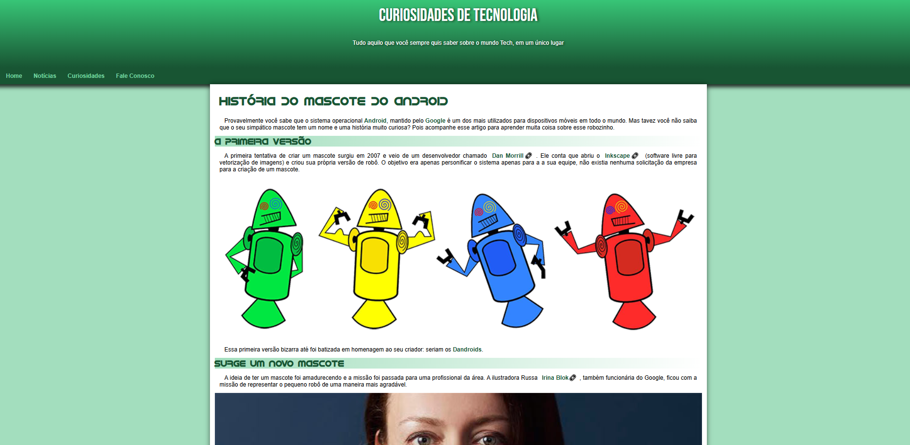

# 🤖 Android Site

Um site simples criado como parte do curso de HTML e CSS do [Gustavo Guanabara](https://www.cursoemvideo.com), apresentando de forma divertida a história do mascote do Android.

---

## 🏷 Badges

---

## 🌐 Acesse o site

🔗 [Clique aqui para visitar o site](https://leonardoftdev.github.io/android-site/)

---

## 🖼 Prévia

## 📁 Estrutura do projet

android-site/
│
├── fontes/         # Fontes usadas no projeto
├── imagens/        # Imagens utilizadas no site
├── index.html      # Página principal
├── style.css       # Estilos do site
└── README.md       # Este arquivo

---

## 🎯 Objetivos de aprendizado

- Praticar conceitos fundamentais de *HTML5* e *CSS3*  
- Estruturar um site simples e responsivo  
- Publicar um projeto utilizando *GitHub Pages*

---

## 🧠 O que foi aprendido

Durante o desenvolvimento deste projeto, foram aplicados conceitos como:
- Uso de tags semânticas no HTML  
- Organização e separação de estilos em arquivos CSS  
- Responsividade com media queries  
- Boas práticas de versionamento com Git e GitHub  

---

## 🧾 Créditos

Projeto desenvolvido com base no conteúdo do curso *HTML5 e CSS3* do [Curso em Vídeo](https://www.cursoemvideo.com) — de Gustavo Guanabara.

---

## 📜 Licença

Este projeto está sob a licença MIT.  
Consulte o arquivo [LICENSE](./LICENSE) para mais informações.

---
 *Criado por [@leonardoftdev](https://github.com/leonardoftdev)* 
